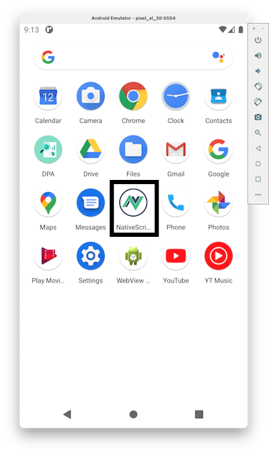

# Exercice 1 : créer et exécuter son premier projet NativeScript-Vue

Cet exercice s'intéresse à la création et l'exécution de votre premier projet [Vue.js](https://vuejs.org/) via le framework [NativeScript-Vue](https://nativescript-vue.org/) pour développer une application mobile hybride. Nous montrons également comment utiliser les composants graphiques spécifiques à [NativeScript-Vue](https://nativescript-vue.org/) en remplacement des composants HTML qui ne sont pas autorisés pour ce type de développement.

Dans la suite de l'exercice, nous utiliserons un dispositif mobile virtuel [Android](https://www.android.com). Si vous souhaitez utiliser un dispositif physique ou basé sur [iOS](https://www.apple.com/ios) la démarche sera la même.

## But

* Compiler et exécuter une application [Vue.js](https://vuejs.org/) sur un dispositif mobile.
* Savoir tracer l'exécution d'une application mobile.
* Créer une application multipages et savoir gérer la navigation.
* Créer un fichier APK ([Android](https://www.android.com)) et le déployer sur le téléphone.

## Étapes à suivre

* Ouvrir un terminal et exécuter la ligne de commande suivante qui permet de créer un projet [NativeScript-Vue](https://nativescript-vue.org/) à partir d'un template. Le nom du projet à renseigner est `ns-exercice1`. Des questions vous seront posées, pour plus de simplicité, laisser les valeurs par défaut (assurez-vous cependant que l'option _vue-devtools_ est bien sélectionnée).

```console
$ vue init nativescript-vue/vue-cli-template ns-exercice1

? Project name: ns-exercice1
? Project description: A native application built with NativeScript-Vue
? Application name: NativeScript-Vue Application
? Unique application identifier: org.nativescript.application
? Project version: 1.0.0
? Author: Mickael BARON <baron@ensma.fr>
? License: MIT
? Select the programming language: javascript
? Select a preset (more coming soon): Simple
? Install vuex? (state management): No
? Install vue-devtools? Yes
? Color scheme: none
```

À la fin de la création du projet, vous devriez obtenir le résultat suivant.

```console
.
├── App_Resources
│   ├── Android
│   └── iOS
├── README.md
├── babel.config.js
├── nativescript.config.ts
├── package.json
├── src
│   ├── app.scss
│   ├── assets
│   │   └── images
│   ├── components
│   │   └── App.vue
│   ├── fonts
│   └── main.js
└── webpack.config.js
```

Vous remarquerez dans le répertoire _src_, le contenu classique d'un projet [Vue.js](https://vuejs.org/). Dans la suite des exercices, nous n'aurons à modifier que ce dossier.

* Exécuter la ligne de commande suivante pour installer tous les modules **npm** qui dépendent de votre projet. Les dépendances sont indiquées dans le fichier _package.json_.

```console
$ npm install
```

* Démarrer l'émulateur [Android](https://www.android.com) si ce n'est pas déjà fait (voir [exercice 0](../vuejs-nativescript-tutorial-exercice0/README.md) pour démarrer l'émulateur créé pour cette série d'exercices).

```console
$ emulator @pixel_xl_30
```

* Pour exécuter le projet [NativeScript-Vue](https://nativescript-vue.org/), il ne vous reste plus qu'à exécuter la ligne de commande suivante.

```console
$ ns clean
$ ns run android
```

> Si vous avez plusieurs périphériques connectés (aussi bien virtuels que physiques), vous pouvez spécifier le périphérique où sera exécuté votre application. Les deux commandes suivantes sont utiles pour lister les périphériques connectés et pour exécuter l'application sur un périphérique identifié.

```console
$ ns device

Connected devices & emulators
Searching for devices...
┌───┬─────────────┬──────────┬───────────────────┬──────────┬───────────┬─────────────────┐
│ # │ Device Name │ Platform │ Device Identifier │ Type     │ Status    │ Connection Type │
│ 1 │ pixel_xl_30 │ Android  │ emulator-5554     │ Emulator │ Connected │ Local           │
└───┴─────────────┴──────────┴───────────────────┴──────────┴───────────┴─────────────────┘

$ ns run --device emulator-5554 android
```


L'application est exécutée et affichée sur le dispostif mobile. Toute modification sur votre code sera impactée sur l'instance de l'application en cours d'exécution puisque la commande `$ ns run android` exécute un service qui écoute tout changement sur les fichiers.

* Ouvrir le fichier _src/components/App.vue_, modifier le contenu de la variable `msg` en `Hello World ENSMA!`, sauvegarder et visualiser la nouvelle version sur votre dispositif mobile.

> Si vous constatez que la mise à jour de l'application ne se fait pas correctement, vous pouvez désactiver le module _Hot Module Replacement (HMR)_.

```console
$ ns run --device emulator-5554 android --no-hmr
```

* Modifier le code du fichier _App.vue_ de façon à ajouter un bouton sur la partie basse de la page qui affichera un message (par exemple : « Bonjour ENSMA ») sur la console de votre ordinateur. Vous devrez utiliser les composants [DockLayout](https://nativescript-vue.org/en/docs/elements/layouts/dock-layout) et [Button](https://nativescript-vue.org/en/docs/elements/components/button). 


Au niveau de la console, où vous avez exécuté la commande `$ ns run --device emulator-5554 android`, vous devriez obtenir les messages de la console suivants quand vous cliquer sur le bouton _Create Log_.

```console
...
JS: {NSVue (Vue: 2.6.12 | NSVue: 2.8.3)} -> AppendChild(DockLayout(5), Label(7))
JS: {NSVue (Vue: 2.6.12 | NSVue: 2.8.3)} -> AppendChild(Page(3), DockLayout(5))
JS: {NSVue (Vue: 2.6.12 | NSVue: 2.8.3)} -> AppendChild(Frame(2), Page(3))
Successfully synced application org.nativescript.application on device emulator-5554.
JS: Bonjour ENSMA
JS: Bonjour ENSMA
JS: Bonjour ENSMA
JS: Bonjour ENSMA
```

## Étapes à suivre pour utiliser l'outil VueDevTools

Une application développée avec [Vue.js](https://vuejs.org/) peut être analysée par l'outil [VueDevTools](https://github.com/vuejs/vue-devtools). Cet outil permet d’introspecter les composants et d'afficher la liste des événements qui ont été émis par un composant. Dans la suite, nous allons voir comment configurer cet outil pour l'utiliser avec [NativeScript-Vue](https://nativescript-vue.org/).

* Mettre fin à l'exécution de l'application (`$ ns run --device emulator-5554 android`).

* Éditer le fichier _App_Resources/Android/src/main/AndroidManifest.xml_ et ajouter dans la balise `<application>` l'attribut `android:usesCleartextTraffic="true"`.

```xml
...
	<application
		android:name="com.tns.NativeScriptApplication"
		android:allowBackup="true"
		android:icon="@drawable/icon"
		android:label="@string/app_name"
		android:theme="@style/AppTheme"
		android:usesCleartextTraffic="true">
...
```

* Depuis un nouveau terminal, exécuter la ligne de commande suivante pour démarrer [VueDevTools](https://github.com/vuejs/vue-devtools) en version standalone.

```console
$ npx vue-devtools
```

Une fenêtre pour [VueDevTools](https://github.com/vuejs/vue-devtools) devrait s'ouvrir. Des instructions sont proposées, mais ne sont pas requises pour une application développée avec [NativeScript-Vue](https://nativescript-vue.org/). Merci de ne pas les prendre en compte.

* Redémarrer l'exécution de l'application (`$ ns run --device emulator-5554 android`), vous devriez obtenir l'écran suivant.


## Étapes à suivre pour gérer la navigation

Nous allons maintenant complexifier notre application en ajoutant une seconde page et en permettant de passer de page en page via un système de navigation. Pour rappel, [Vue Router](https://router.vuejs.org/) n'est pas supporté sur [NativeScript-Vue](https://nativescript-vue.org/), il faut donc passer par une navigation manuelle. Deux fonctions sont disponibles :

* `$navigateTo(nomComposant, Options)` : changer une page en précisant le nom du composant ;
* `$navigateBack` : retour à la page précédente.

* Créer un nouveau composant appelé `DisplayImage.vue` qui permettra d'afficher une image qui sera donnée en paramètre (via les **Props**).

```javascript
<template>
    <Page actionBarHidden=true>
        <DockLayout stretchLastChild="true">
          <Button dock="bottom" text="Back" @tap="$navigateBack" />
          <Image :src="image" stretch="aspectFit" />
        </DockLayout>
    </Page>
</template>

<script >
  export default {
    props: {
      image : String
    }
  }
</script>

<style scoped>
    .message {
        vertical-align: center;
        text-align: center;
        font-size: 20;
        color: #333333;
    }
</style>
```

* Depuis le fichier `App.vue` effectuer les modifications suivantes :
  * Importer le composant _DisplayImage_ : `import DisplayImage from '@/components/DisplayImage';` ;
  * Ajouter un bouton sur la partie _Top_ qui déclenche la méthode `onGoImagePage` ;
  * Coder la méthode `onGoImagePage` pour naviguer vers le composant _DisplayImage_, qui utilise un transisition et qui transmet à la *Props* `image` une URL.

Pour l'option à transmettre à la méthode `onGoImagePage`, vous pouvez vous baser sur le code suivante.

```javascript
onGoImagePage() {
  this.$navigateTo(DisplayImage, {
      transition : {
      name: 'flip',
      duration: 800
    },
    props : {
      image: "https://i0.wp.com/bde.ensma.fr/wp-content/uploads/2019/05/ensmadehaut.jpg?fit=1000%2C667&ssl=1"
    }
  });
}
```

Le résultat attendu devrat être le suivant.


## Étapes à suivre pour installer un APK

Pour terminer, cet exercice, nous allons voir comment générer le fichier APK et l'installer avec l'outil **adb**.

* Arrêter l'exécution de l'application (`$ ns run --device emulator-5554 android`) et exécuter la ligne de commande suivante.

```console
$ ns build android
```

Le résultat de cette commande sera de construire un fichier APK dans le répertoire _platforms/android/app/build/outputs/apk/debug/app-debug.apk_.

> Une version _release_ peut être construire en ajoutant l'option `--release`. Il faudra toutefois préciser les options pour le fichier _keystore_ qui sert à signer le fichier APK.

* Vérifier d'avoir votre émulateur ([Android](https://www.android.com)) de démarré et exécuter la ligne de commande suivante pour transférer l'APK sur votre téléphone.

```console
$ adb install platforms/android/app/build/outputs/apk/debug/app-debug.apk
Performing Streamed Install
Success
```



## Ressources

* https://nativescript-vue.org/en/docs/getting-started/vue-devtools/
* https://nativescript-vue.org/en/docs/routing/manual-routing/