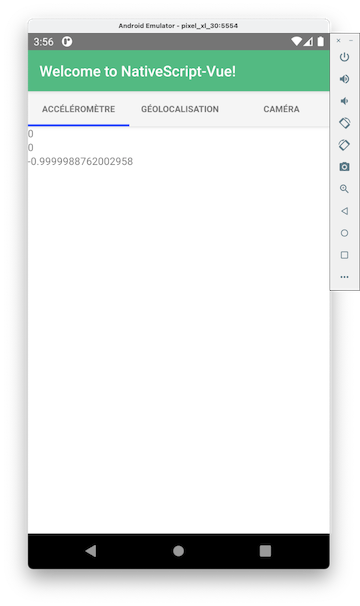
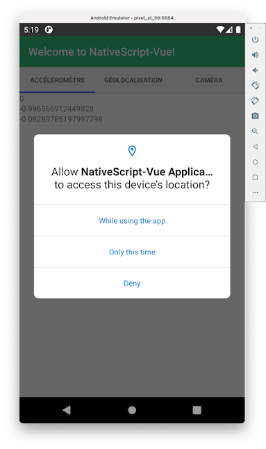
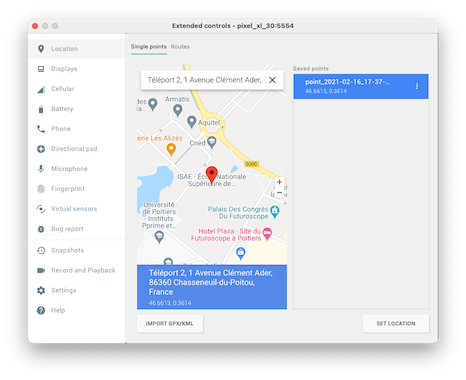
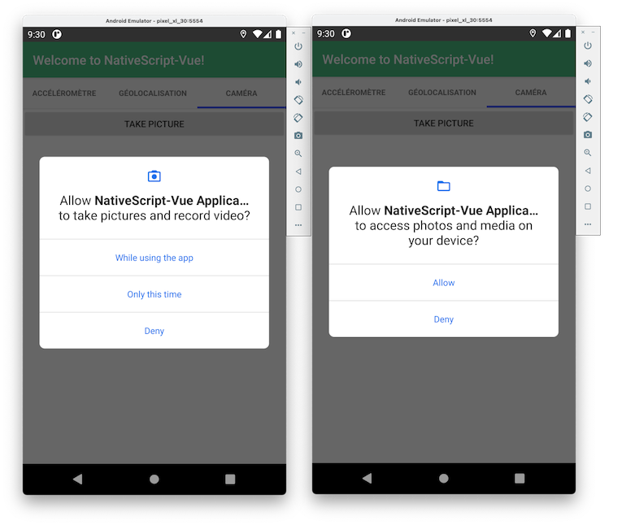
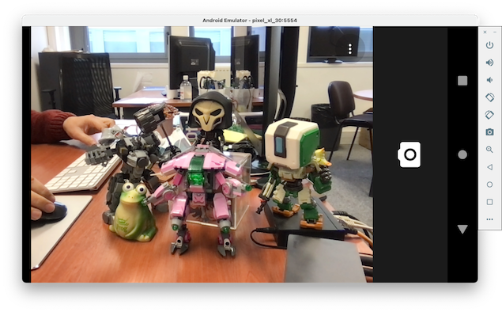
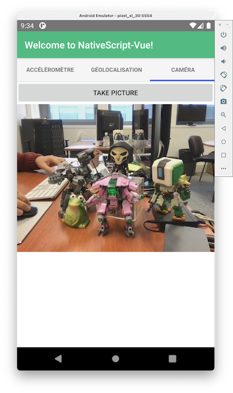

# Exercice 2 : utiliser les API natives d'un dispositif mobile avec NativeScript-Vue

Cet exercice s'intéresse à l'utilisation des API natives des dispositifs mobiles afin d'accéder aux données liées à l'accéléromètre, la géolocalisation et la caméra en utilisant [NativeScript-Vue](https://nativescript-vue.org/). Nous montrons également comment gérer les permissions pour autoriser l'accès à ces API natives sans explicitement le coder dans le projet [Vue.js](https://vuejs.org/). Ainsi, votre code pourra fonctionner sans problème sur [Android](https://www.android.com) et [iOS](https://www.apple.com/ios).

Dans la suite de l'exercice, nous utiliserons un dispositif mobile virtuel [Android](https://www.android.com). Si vous souhaitez utiliser un dispositif physique ou basé sur [iOS](https://www.apple.com/ios), la démarche sera la même.

## But

* Accéder aux données de l'accéléromètre, la géolocalisation et la caméra.
* Donner des permissions pour accéder aux API natives.

## Étapes à suivre pour initialiser le projet

* Ouvrir un terminal et exécuter la ligne de commande suivante qui permet de créer un projet [NativeScript-Vue](https://nativescript-vue.org/) à partir d'un template. Le nom du projet à renseigner est `ns-exercice2`. Des questions vous seront posées, pour plus de simplicité, laisser les valeurs par défaut.

```console
$ vue init nativescript-vue/vue-cli-template ns-exercice2
```

* Éditer le fichier _src/components/App.vue_ et remplacer par le code donné ci-dessous.

```javascript
<template>
  <Page>
    <ActionBar title="Welcome to NativeScript-Vue!" />
    <StackLayout>
      <TabView>
          <TabViewItem title="Accéléromètre">
          <!-- <AccelerometerComponent /> -->
          <Label text="TODO: AccelerometerComponent" />
        </TabViewItem>
        <TabViewItem title="Géolocalisation">
          <!-- <LocationComponent /> -->
          <Label text="TODO: LocationComponent" />
        </TabViewItem>
        <TabViewItem title="Caméra">
          <!-- <CameraComponent /> -->
          <Label text="TODO: CameraComponent" />
        </TabViewItem>
      </TabView>
    </StackLayout>
  </Page>
</template>

<script >
// import AccelerometerComponent from "@/components/AccelerometerComponent";
// import LocationComponent from "@/components/LocationComponent";
// import CameraComponent from "@/components/CameraComponent";

export default {
  components: {
    // AccelerometerComponent,
    // LocationComponent,
    // CameraComponent,
  },
};
</script>

<style scoped>
ActionBar {
  background-color: #53ba82;
  color: #ffffff;
}
</style>
```

Il s'agit du composant principal qui contiendra les trois composants développés pour manipuler respectivement l'accéléromètre, la géolocalisation et la caméra. Au fur et à mesure de l'avancé de cet exercice, nous déclarerons un composant développé comme élément du composant `TabView`. Il faudra décommenter au fur et à mesure chaque composant.

## Étapes à suivre pour utiliser l'accéléromètre

Nous commençons par l'accès aux données transmises par l'accéléromètre. Cette API native ne requiert pas de permission spécifique. L'accéléromètre retourne les accélérations linéaires selon trois axes orthogonaux (x, y et z).  

* Créer un nouveau fichier _src/components/AccelerometerComponent.vue_ qui servira à afficher les données de l'accéléromètre. Compléter ce fichier par le code ci-dessous.

```javascript
<template>
  <StackLayout>
    <Label v-bind:text="accelerometerValues.x"></Label>
    <Label v-bind:text="accelerometerValues.y"></Label>
    <Label v-bind:text="accelerometerValues.z"></Label>
  </StackLayout>
</template>

<script>
var accelerometer = require("nativescript-accelerometer");

export default {
  data() {
    return {
      accelerometerValues: {
        x: null,
        y: null,
        z: null,
      },
    };
  },
  mounted() {
    accelerometer.startAccelerometerUpdates(
      (data) => {
        this.accelerometerValues = data;
      },
      {
        sensorDelay: "ui",
      }
    );
  },
};
</script>
```

Les informations de l'accéléromètre sont transmise par la fonction `startAccelerometerUpdates` qui retourne des nouvelles valeurs selon une fréquence de rafraichissement. Cette fréquence `sensorDelay` peut recevoir les valeurs suivantes : `normal` (0.2 second), `ui` (0.06 second), `game` (0.02 second) et `fastest` (aussi vite que possible). Bien entendu, plus la valeur de `sensorDelay` est basse, plus votre système transmet des informations fraiches avec le problème d'une surconsommation de ressource. Le choix de la valeur de `sensorDelay` doit être réaliste.

* Depuis la ligne de commande, ajouter le plugin `nativescript-accelerometer` au projet (le fichier _package.json_ sera impacté).

```console
$ ns plugin add nativescript-accelerometer
```

* Modifier le fichier _src/components/App.vue_ de façon à décommenter tout ce qui concerne le composant *AccelerometerComponent*.

* Démarrer l'émulateur [Android](https://www.android.com) si ce n'est pas déjà fait (voir [exercice 0](../vuejs-nativescript-tutorial-exercice0/README.md) pour démarrer l'émulateur créé pour cette série d'exercices).

```console
$ emulator @pixel_xl_30
```

* Pour exécuter le projet [NativeScript-Vue](https://nativescript-vue.org/) et tester la récupération des données de l'accéléromètre, il ne vous reste plus qu'à exécuter la ligne de commande suivante.

```console
$ ns run android
```



Sur l'émulateur, il est assez difficile de vérifier le fonctionnement de l'accéléromètre. Vous pouvez toutefois changer l'orientation du téléphone et vous constaterez que les valeurs changent.

* Stopper l'émulateur.

## Étapes à suivre pour utiliser la géolocalisation

Nous continuous cet exercice en s'intéressant à l'utilisation du capteur de géolocalisation. Le processus est le même que pour le capteur de l'accéléromètre, excepté le fait que nous allons devoir gérer la permission. Cette permission consiste à demander à l'utilisateur, s'il souhaite que l'application qui utilise votre capteur puisse accéder aux données de géolocalisation. Cette demande est nécessaire à chaque nouvelle installation.

* Créer un nouveau fichier _src/components/LocationComponent.vue_ qui servira à afficher les données de géolocalisation. Compléter ce fichier par le code ci-dessous.

```javascript
<template>
  <StackLayout>
    <Label v-bind:text="origin.latitude"></Label>
    <Label v-bind:text="origin.longitude"></Label>
  </StackLayout>
</template>

<script>
var geolocation = require("@nativescript/geolocation");

import { Accuracy } from "ui/enums";

export default {
  data() {
    return {
      origin: {
        latitude: 0,
        longitude: 0,
      },
    };
  },
  mounted() {
    geolocation
      .enableLocationRequest(true, true)
      .then(
        () => {
          this.watch = geolocation.watchLocation(
            (res) => {
              let lat = res.latitude;
              let lng = res.longitude;
              this.origin.latitude = lat;
              this.origin.longitude = lng;
            },
            (error) => {
              console.log(error);
            },
            {
              desiredAccuracy: Accuracy.high,
              updateTime: 1000
            }
          );
        },
        (e) => {
          console.log("error: " + (e.message || e));
        }
      )
      .catch((ex) => {
        console.log("Unable to Enable Location", ex);
      });
  },
};
</script>
```

Nous utilisons la fonction `watchLocation` qui retourne de nouvelles valeurs de la géolocalisation selon des options. Ces options permettent de fixer la fréquence de rafraichissement. Dans la configuration actuelle, le temps de mise à jour est fixé à `1000ms` et la précision est fixée à `high`. Il existe d'autes paramètres avec des valeurs par défaut. Veuillez consulter cette documentation pour plus de détails : <https://github.com/NativeScript/nativescript-geolocation>. Avant l'utilisation de la fonction `watchLocation`, l'application demande l'autorisation à l'utilisateur (fonction `enableLocationRequest`) pour qu'elle puisse exploiter les données de géolocalisation. 

La permissions pour accéder aux capteurs de géolocalisation ne peut fonctionner que si vous avez déclaré explicitement les permissions dans les configurations des plateformes [Android](https://www.android.com) et [iOS](https://www.apple.com/ios). Ces configurations sont disponibles dans le répertoire _App_Resources_. Voyons comment procéder pour la plateforme [Android](https://www.android.com).

* Éditer le fichier _App_Resources/Android/src/main/AndroidManifest.xml_ et ajouter les deux balises suivantes.

```xml
	<uses-permission android:name="android.permission.ACCESS_COARSE_LOCATION"/>
    <uses-permission android:name="android.permission.ACCESS_FINE_LOCATION"/>
```

* Depuis la ligne de commande, ajouter le plugin `@nativescript/geolocation` au projet (le fichier _package.json_ sera impacté).

```console
$ ns plugin add @nativescript/geolocation
```

> Veuillez noter la présence du caractère `@` qui précise qu'il s'agit d'une version du plugin pour la nouvelle version de [NativeScript](https://nativescript.org/).

* Modifier le fichier _src/components/App.vue_ de façon à décommenter tout ce qui concerne le composant *LocationComponent*.

* Démarrer l'émulateur [Android](https://www.android.com).

```console
$ emulator @pixel_xl_30
$ ns run android
```

* Exécuter le projet [NativeScript-Vue](https://nativescript-vue.org/) dans un autre terminal.

```console
$ ns run android
```



Pour tester le fonctionnement de votre application, vous pouvez simuler le déplacement de votre dispositif mobile virtuel depuis l'émulateur [Android](https://www.android.com).

* Ouvrir les préférences de l'émulateur (les trois points horizontaux), choisir le menu _Location_, rechercher dans la barre d'adresse _ISAE-ENSMA_, faire **Save Point** et enfin cliquer sur **Set Location**.



À chaque modification des coordonnées GPS, les valeurs sont affichées dans l'application que nous venons de développer.

* Stopper l'émulateur.

## Étapes à suivre pour utiliser la caméra

Nous terminons cet exercice en s'intéressant à l'accès à la caméra du dispositif mobile afin de réaliser des captures photos. Nous aurons besoin de demander la permission pour accéder aux données de la caméra et de déclarer la webcam de votre ordinateur pour l'utiliser depuis l'émulateur. Bien entendu, pour ce dernier point, une webcam doit être présente. 

* Créer un nouveau fichier _src/components/CameraComponent.vue_ qui servira à prendre des photos depuis la caméro d'un dispositif mobile. Compléter ce fichier par le code ci-dessous.

```javascript
<template>
  <StackLayout>
    <Button text="Take Picture" @tap="takePicture" />
    <Image :src="image" stretch="aspectFit" />
  </StackLayout>
</template>

<script>
var camera = require("@nativescript/camera");

export default {
  data() {
    return {
      image: null,
    };
  },
  methods: {
    takePicture() {
      camera
        .requestPermissions()
        .then(() => {
          camera
            .takePicture({ saveToGallery : true })
            .then((imageAsset) => {
              this.image = imageAsset;
            })
            .catch((err) => {
              console.log("Error -> " + err.message);
            });
        })
        .catch((ex) => {
          console.log("Unable to Enable Camera", ex);
        });
    },
  },
};
</script>
```

Une méthode `takePicture()` est déclarée et sera invoquée à chaque fois que l'utlisateur cliquera sur le bouton **Take Picture**. Le code de cette méthode permet dans un premier temps de demander à l'utilisateur l'accès à la caméra. Si cet accès est autorisé, alors l'application **Caméra** par défaut sera utilisée. Contrairement au capteur de géolocalisation, la permission pour l'accès à la caméra ne requiert pas de modifier les fichiers de configuration des plateformes (fichier _App_Resources/Android/src/main/AndroidManifest.xml_ pour [Android](https://www.android.com)).

* Depuis la ligne de commande, ajouter le plugin `@nativescript/camera` au projet (le fichier _package.json_ sera impacté).

```console
$ ns plugin add @nativescript/camera
```

* Modifier le fichier _src/components/App.vue_ de façon à décommenter tout ce qui concerne le composant *CameraComponent*.

Si vous disposez d'un ordinateur équipé d'une webcam, vous pouvez l'utiliser depuis votre émulateur [Android](https://www.android.com). 

* Exécuter la ligne de commande suivante pour lister l'ensemble des webcams disponibles.

```console
$ emulator -webcam-list
List of web cameras connected to the computer:
 Camera 'webcam0' is connected to device '0x8020000005ac8514' on channel 0 using pixel format 'YV12'
```

Une webcam a été identifiée _webcam0_. 

* Exécuter la ligne de commande suivante pour démarrer l'émulateur en lui associant la caméra de votre ordinateur.

```console
$ emulator  -camera-back webcam0 @pixel_xl_30
```

L'option `-camera-back` permet d'associer votre webcam pour la caméra situé derrière le téléphone. Vous pouvez également utiliser l'option `-camera-front` pour la caméra situé au niveau de l'écran.

* Exécuter le projet [NativeScript-Vue](https://nativescript-vue.org/) dans un autre terminal.

```console
$ ns run android
```



Deux permissions sont demandées : l'une pour l'accès à la caméra et la seconde pour l'accès aux photos et vidéos. Cette dernière est utilisée si l'utilisateur souhaite enregistrer les photos dans le dispositif mobile.



Quand le bouton **Take Picture** est cliqué, l'application **Caméra** du dispostif mobile est démarrée.



Une fois la photo prise, le contenu de l'image est affiché dans l'application développée.

## Aller plus loin (boîte à idées 📮)

* Implémenter le mouvement d'agitation (Shaker) de votre téléphone en vous basant sur ce lien : https://nativescript.org/blog/detecting-shakes-in-nativescript/

## Ressources

* https://github.com/NativeScript/plugins
* https://github.com/NativeScript/plugins/tree/master/packages/camera
* https://github.com/NativeScript/plugins/tree/master/packages/geolocation